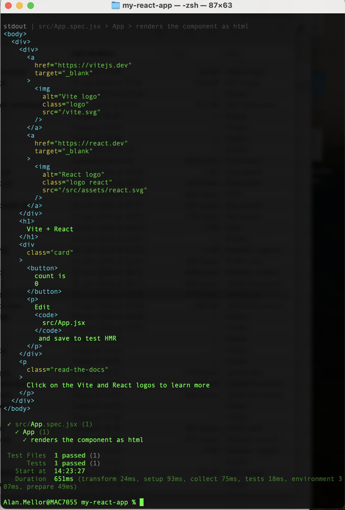
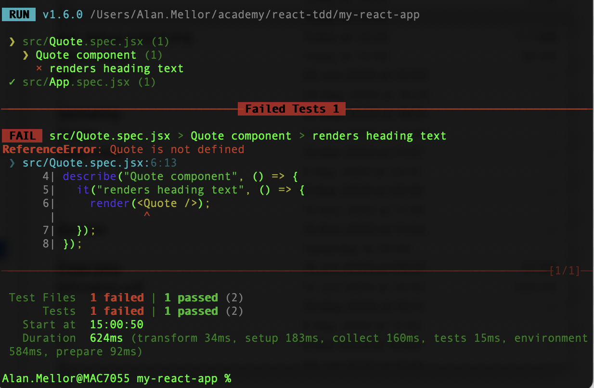
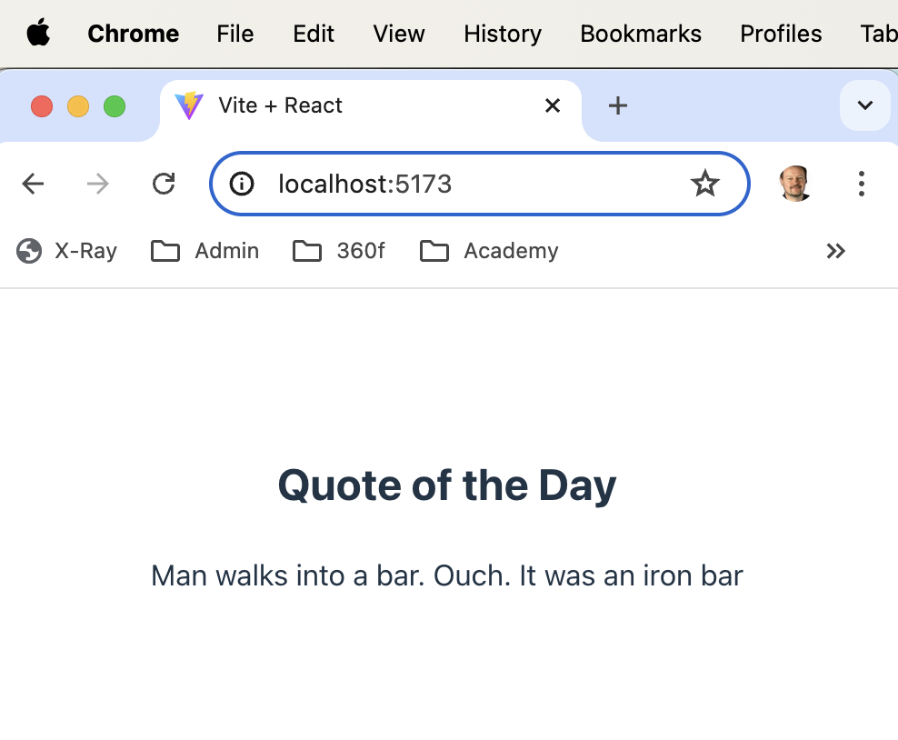

# React TDD

Using a test-driven approach to React development.

## Installation

Following on from our [React Basics](https://github.com/bjssacademy/react-basics) guide, we will continue to use React and Vite.

To start using TDD, we're going to need some new tools:

- **vitest** a vite-friendly test runner analogous to jest
- **React Testing Library** enabling inspection of React output

### Start with a vite project

[Create the React App](https://github.com/bjssacademy/react-basics/blob/main/chapter1.md) by following those instructions.

You should get to the part where you can run the React app with

```bash
npm run dev
```

and see this in your browser:


Once you can see the React skeleton app working, we can install the test tools.

### Navigate to the React app directory

Type

```bash
cd my-react-app
```

and you can even double-check by typing `pwd`. If you are using Mac or Linux, that is. Windows generally shows the full path in the command prompt. Simply give it a quick check.

We need to add the test tools to the parent directory of our React app.

### Install vitest

Install our test runner, vitest:

```bash
npm install vitest --save-dev
```

### Configure package.json

Configure the project to use vitest and vite. Add the following to `package.json` of the React application:

```json
  "scripts": {
    "dev": "vite",
    "build": "vite build",
    "lint": "eslint . --ext js,jsx --report-unused-disable-directives --max-warnings 0",
    "preview": "vite preview",
    "test": "vitest"
  },
```

Most of this came from vite previously. The line we need to add is the final line `"test": "vitest"`.

### Install React Testing Library

React Testing Library (RTL) allows our tests to introspect html output, simulate user events and intercept calls to external APIs.

Install RTL:

```bash
npm install @testing-library/react @testing-library/jest-dom --save-dev
```

### Install jsdom

We will be testing outside of the browser. Our tests will access a simulated browser DOM (Document Object Model) to assert correctness of our React components. We will use jsdom as our 'virtual DOM'.

Install jsdom:

```bash
npm install jsdom --save-dev
```

Replace the contents of file `vite.config.js` with this:

```jsx
import { defineConfig } from "vite";
import react from "@vitejs/plugin-react";

export default defineConfig({
  plugins: [react()],
  test: {
    environment: "jsdom",
    globals: true,
    setupFiles: ["@testing-library/jest-dom"],
  },
});
```

This instructs vite to use JSDOM as its virtual DOM, and use the setup files bundled with React testing Library.

### Check we're all set ...

Type the command:

```bash
npm run -- --test
```

The terminal output should have this as its last line:

```bash
No test files found, exiting with code 1
```

That's exactly as we expect; we have yet to write our first test!

The setup is done and dusted. Make yourself a nice hot cup of tea, and mentally prepare for writing our first test. Oooh - exciting! I love me a good test in the morning.

## A peek under the covers of the DOM

Let's use the test framework to render the React `<App />` component we already have. Find the file `App.jsx`, and write a new file in the same directory called `App.spec.jsx`.

Put this content into `App.spec.jsx`:

```jsx
import { render, screen } from "@testing-library/react";

import App from "./App";

describe("App", () => {
  it("renders headline", () => {
    render(<App title="React" />);

    screen.debug();
  });
});
```

Run this code by using the command:

```bash
npm run -- --test
```

What do you see?

### Checking DOM output using screen.debug()

Here's what I get in my terminal:



This is what's contained in the JSDOM virtual DOM. It is the DOM as it will be rendered in our browser - when we finally use a browser.

It is pure, raw html.

### Errr, where's all the React gone?

Now ... that isn't _quite_ what we were expecting, was it?

I mean, where's all the React stuff? Components and props and hooks and JavaScript? Not even a smidgen of JSX? What's going on?

There's an important TDD principle at work here.

> Test observable behaviour, not implementation details

The React Testing library has the philsophy that we should test a web page as close to how a human user sees that page as possible.

As a result, we're not going to look into specific implementation details of React components in our tests. That only makes our tests _brittle_.

Instead, our tests will consider only:

- user-visible output
- simulating user actions, such as clicks
- simulating external HTTP web services

React Testing Library provides us with methods on the `screen` object to help us access visible data, much as a human would.

> This approach **promotes accessibility** in our web pages - very important!

Let's write a test for a suitably ~~dull~~ exciting exercise component: the Quote of the Day.

## Writing our first React Test

As we learned in [Advanced TDD with Go](https://github.com/bjssacademy/advanced-tdd), the best way to write a test before code is to think of it as an executable specification.

We're going to write a basic React component to show us a Quote of the Day.

The basic specification is:

- Accepts a piece of text, the quote of the day
- Renders this quote as normal text
- Provides a heading above the quote

We can make some good-practice design decisions:

- The component will be called `<Quote />`
- The text will be passed as a property named `text`

To write our first test, we capture those decisions into test code.

We're using vitest syntax for this. This syntax is designed to be identical to the Jest test frameowrk, as that is very widely known. Vitest integrates better with vite.

### Create the test file

Create a file `Quote.spec.jsx` with the following content:

```jsx
import * as React from "react";
import { render } from "@testing-library/react";

describe("Quote component", () => {
  it("renders heading text", () => {
    render(<Quote />);
  });
});
```

We're starting by adding only the _Arrange_ and _Act_ sections of our test.

- We've captured the intent in our messages that the `Quote component` `renders heading text`.
- `render(<Quote />);` will render our component html into the virtual DOM

We can run this partial test using

```bash
npm run -- --test
```

and we'll get a test failure:



The error test confirms that we've asked a `<Quote />` component to render, but we do not have that component.

Let's add the React component file, and call it `Quote.jsx':

```jsx
const Quote = () => {};

export default Quote;
```

We need to import that into our test file:

```jsx
import * as React from "react";
import { render } from "@testing-library/react";

import Quote from "./Quote";

describe("Quote component", () => {
  it("renders heading text", () => {
    render(<Quote />);
  });
});
```

When we run the test using

the test passes. We have a Quote component available.

The next step is to make it do something.

### Rendering the header text

Following the requirements, our component needs to display some header text.

Let's take the approach of writing a weak test to get us started, then strengthening it later.

The weak version of test will confirm only that the correct text is displayed, nothing more.

Add the following to `Quote.spec.jsx`:

```jsx
import * as React from "react";
import { render, screen } from "@testing-library/react";

import Quote from "./Quote";

describe("Quote component", () => {
  it("renders heading text", () => {
    render(<Quote />);

    expect(screen.getByText("Quote of the Day")).toBeInTheDocument();
  });
});
```

We run the test using

```bash
npm run -- --test
```

and as expected, the test fails, telling us that no such text can be found:


That's simple enought ofix. We add _just enough_ code to the component to fulfil this part of our specification:

```jsx
const Quote = () => {
  return "Quote of the Day";
};

export default Quote;
```

Once we run the test again, it passes.

### Converting the text into a header

We've only specified part of what we need to do. There is no the correct text being displayed for our heading. But it isn't a heading.

The `screen` object allows us to define the kind of heading we want to find. We define it using the ARIA roles for accessibility.

In our test, we say we want to find something displayed with the ARIA role of `heading`. We would like that to be at `level 2`.

Let's add this level of detail into our existing test, to strngthen it:

```jsx
import * as React from "react";
import { render, screen } from "@testing-library/react";

import Quote from "./Quote";

describe("Quote component", () => {
  it("renders heading text", () => {
    render(<Quote />);

    expect(screen.getByRole("heading", { level: 2 })).toHaveTextContent(
      "Quote of the Day"
    );
  });
});
```

We are searching for something an ARIA reader would recognise as a heading, level 2. We then check that our desired heading text is present in that element.

Running the test will fail, as we do not have any such heading yet.

Let's add the heading html into our Component JSX:

```jsx
const Quote = () => {
  return <h2>Quote of the Day</h2>;
};

export default Quote;
```

Run the test. It passes.

### Passing in the quote as a property

Our final piece of work involves displaying the actual quotation itself. We took a design decision to pass in the quote text as a React property, called `text`.

Let's specify this in a new test, added to our _describe_ block of `Quote.spec.jsx`:

```jsx
it("renders quotation passed in as property", () => {
  render(<Quote text="Truth eludes power" />);

  expect(screen.getByText("Truth eludes power")).toBeInTheDocument();
});
```

We run that test and watch it fail. Ah, the very heartbeat of our misery.

Anyway, cheer up. We can add this code into `Quote.jsx' to make it pass:

```jsx
const Quote = ({ text }) => {
  return (
    <>
      <h2>Quote of the Day</h2>
      <p>{text}</p>
    </>
  );
};

export default Quote;
```

The test will now pass.

## Visual inspection of the Quote component

With user interface work, it's always important to _actually look_ at what we're building.

Even using test-first TDD - or perhaps especially when using it - we must check layouts and conformance to visual design rules. TDD will help us develop components that we can trust to work. But the _Mark 1 Eyeball, Human_ remains the final arbiter of taste.

We had an `<App />` component generated for us by vite. Let's replace it's content with an example use of our shiny new Quote component.

In file `App.jsx`, replace the content with this:

```jsx
import "./App.css";
import Quote from "./Quote";

function App() {
  return <Quote text="Man walks into a bar. Ouch. It was an iron bar" />;
}

export default App;
```

We can run the vite server using the command line:

```bash
npm run dev
```

We need to follow the instuctions given on the terminal output to find the correct URL for our browser:


Navigating to this URL in Chrome shows us our `<Quote />` component in all its glory:



## Further Reading

- [react testing Library Cheatsheet](https://testing-library.com/docs/react-testing-library/cheatsheet/)
- [React Testing Library Tutorial](https://www.robinwieruch.de/react-testing-library/)
- [Vitest documentation](https://vitest.dev/guide/)
- [BJSS Academy Advanced TDD in Go](https://github.com/bjssacademy/advanced-tdd)
- [Mastering React Test-Driven Development](https://www.oreilly.com/library/view/mastering-react-test-driven/9781803247120)
